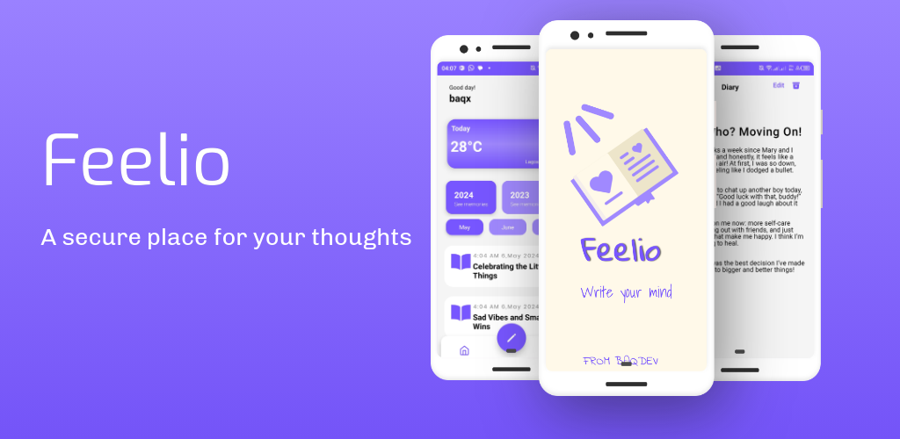

<h1 align="center">Feelio</h1>

<p align="center">
  
</p>

<p align="center">
  
</p>

<br/>

## 📖 Introduction

**Feelio** — Your Private Space 📝

Feelio is a secure and beautiful digital diary app designed to help you express yourself freely.  
Write your thoughts, feelings, and stories in a safe environment. Reflect on your journey, and grow with Feelio.

Start writing your story today! 🚀

---

## 🛠️ Requirements

- [Node.js](https://nodejs.org/)
- [npm](https://www.npmjs.com/) or [yarn](https://yarnpkg.com/)
- [Expo](https://expo.dev/)
- [React Native](https://reactnative.dev/)

> Make sure you have Expo CLI installed locally:  
> ```bash
> npx expo start
> ```

---

## ✨ Features

- 🔒 Lock your diary with a password
- 🎨 Customize your interface with different colors
- 🗂️ Organize your thoughts easily
- ☁️ Access your diary anywhere, anytime
- 🌤️ View live weather information inside the app

---

## ⚙️ Setup

Clone the repository:

```bash
git clone https://github.com/HoussemZorgui/feelio-react-native.git
cd feelio
